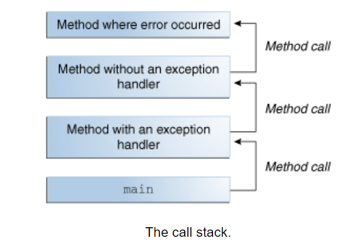
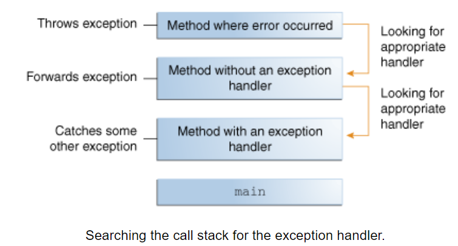
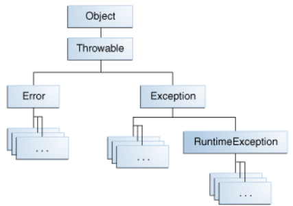

# Language features #3

- Inheritance
- Abstract classes
- Interfaces
- Annotations
- Exceptions
- Streams
- Generics
- Collections
- Data Structures
- Iteration

## Inheritance

- Every class has a parent - except `Object`
- One class have one parent only.
- Inheritance is multi level in Java.
- An abstract class may have abstract method(s);
- Abstract classes couldn't be instantiated.
- Interface is like a fully abstract class - more or less
- Interfaces need to be implemented while abstract classes need to be extended
- A class can extend one other (abstract or not) class while can implement many interfaces.
- `final` class cannot be extended. (E.g `java.lang.String`)
- **Az osztályok esetén nincsen többszörös öröklődés!**

### What can you do in a subclass?

- Access inherited fields.
- You can declare fields (even with the same as in parent - not recommended).
- Access inherited methods.
- You can write new instance methods (even with the same signature - that is overriding).
- You can write new static methods (even with the same signature).
- You can write new constructor what could override a super one.
- Access modifiers can allow more but not less access for the overridden method/field.
- Recommended to use the `@Override` annotation for safety reasons.

### Polymorphism

- If `RoadBike` extends `Bicycle` then a `RoadBike` instance can be passed wherever a `Bicycle` required.
- This is the reason why you can not declare more restrictive access level for fields and methods.

### Casting

- Casting shows the use of an object of one type in place of another type, among the objects permitted by inheritance and implementations

```java
Object obj = new MountainBike();
MountainBike myBike = obj; // compile error
MountainBike myBike = (MountainBike)obj; // OK
```

## Abstract classes

- Provide a common interface to use all subclasses (not just public, but for the repr. too)
- Methods w/o implementations: `abstract`
    * Subclass must implement these (unless it is `abstract` too)
    * Abstract cannot be `private/final/static`
  
### Sample code:
    
```java
abstract class Shape{
    protected boolean convex;

    public Shape(boolean convex){
        this.convex = convex;
    }

    public abstract double circumference();
    public abstract double area();

    public void dump(){
        System.out.println("C=" + circumference());
        System.out.println("A=" + area());
    }
}

class Circle extends Shape{
    public static final double PI = 3.1415;
    private double r;

    public Circle(){
        this(1.0);
    }

    public Circle(double r){
        super(true);
        this.r = r;
    }

    @Override
    public double circumference() {
        return 2 * r * PI;
    }

    @Override
    public double area() {
        return Math.pow(r, 2) * PI;
    }
}
```

### Usage:

```java
public class Main{
    public static void printArea(Shape shape){
        System.out.println( shape.area());
    }

    public static void main(String[] args) {
        Shape s = new Circle(10); // cf. static-dynamic type
        printArea( s );
    }
}
```

## Interfaces

- new reference type
- pre-Java8: pure abstract classes
  * All methods are public, abstract by default
  * All members are public, static, final by default
- Implementation by the `implements` keyword

- Differences to classes:
  * Multi inheritance
  * No common parent (like Object)
  * (pre-Java8) No implementation
  
```java
public interface GroupedInterface extends Interface1, Interface2, interface3 { ... }

// OR

class A extends B implements I1, I2 { ... }
```

### Interfaces - Sample

```java
interface ConsoleReadable{
    public abstract void readFromConsole();
}

class Circle implements ConsoleReadable{
    public void readFromConsole(){
        String line = Console.readLine("r = ? ");
        r = Integer.parseInt(line);
    }
}
```

## Annotations

- A form of metadata, about the program `@`
- Possible use cases:
  * Information for the compiler
  * Compile-time and deployment time processing
  * Runtime processing
  
- Format
  * `@Override`
  * `@SuppressWarnings("unchecked")`
  * `@Author(name = "Denes Varga", date7"1/23/2014")`
  
- Where can be applied:
  * Declaration of class
  * -||- of fields
  * -||- arguments
  * --|| methods
  * On other annotations
  * Java 8 extend this list

### Most typical annotations in J2SE API

* `@Deprecated` -  metodus kompatibilitasi okokbol van ott (a metodus)
* `@Override`
* `SuppressWarning` - 

```java
@Product(name = "This is a book")
public class Book{
}
```

```java
import java.lang.annotation.Documented;

@Documented
@interface Product{
    String name();
}
```

## Exceptions

C-era:

```java
if(malloc(...)){
    if(arraycpy(...)){
        if(free(...)){
            .. // OK
        }
        else{
            // Free failed...
        }
    }
    else{
        // Arraycopy failed...
    }
}
else{
    // Malloc failed
}
```

- Error handling and effective code is mixed up
- *Note:* setjmp/longjmp may help but still...

### Exception - Motivation

C++
- Everything may be thrown
- Specification of thrown elements are not mandatory
- Handling errors are not mandatory

### Exception - Java

```java
try{
    ... // Critical statemetns
}
catch (Exception e1){
    ...
}
catch (Exception e2){
    ...
}
finally{
    ...
}
```

- `try`: covers the critical statements
- `catch`: are specific to exception types (even rethrowing is possible)
- `finally`: always executed (well...)
- Other forms:

```java
try{
    ...
}
finally{
    ...
}

try{
    ...    
}
catch(Throwable t){
    ...    
}
```

### How to do the C-style stuff?

```java
try{
    malloc(...);
    arraycpy(...);
    free(...);
}
catch (MallocFailedException e){
    ...   
}
catch (ArrayCopyFailedException e){
    ...
}
catch (FreeFailedException e){
    ...
}
```

### What NOT to do?

```java
try {
    malloc(...);
}
catch (MallocFailedException e){
    ...
}
...
try{
    arraycpy(...);
}
catch (ArrayCopyFailedException e){
    ...
}
...
try{
   free(...);
}
catch (FreeFailedException e){
    ...
}
```

### Exception handling - How?

Empty exception handling case? **Never!**

```java
try{
  ...
}
catch (Exception e){
  e.printStackTrace();

  // or
  System.out.println(e.getMessage());

  //or
  LOGGER.log(e);
}
```





- Kind of exceptions:
  - Checked exceptions: derived from `java.lang.Exception`
  - Unchecked exceptions: derived from `java.lang.RuntimeException`
  - Errors: derived from `java.lang.Error`
  
https://docs.oracle.com/javase/tutorial/essential/exceptions/

### Exceptions Hierarchy



- Class hierarchy:
  - `java.lang.Object`
    - `java.lang.Throwable`
      - `java.lang.Error`
        - OutOfMemoryError, IOError, ...
      - `java.lang.Exception`
        - IOException, FileNotFoundException, ...
          - `java.lang.RuntimeException`
          - ArrayIndexOutOfBoundsException, NumberFormatException, DivisionByZeroException, IllegalStateException, IllegalArgumentException, ...

### What you can do with an Exception

- "Catch or Specify"
  * Checked exceptions: **must** be caught or specified
  * Unchecked exceptions: **could be** caught or specified
  * Error: **shouldn't be** handled - cannot really be handled in programs

```java
class Main{
    public static void main(String[] args) {
        try{
            int res = Integer.parseInt(args[0]);
            // ...
        }
        catch (NumberFormatException e){
            System.err.println("Invalid input: " + args[0]);
            e.printStackTrace();
        }
    }
}
```

```java
public static int minPlace(final int[] arr){
    if ( 0 == ar.length){
        throw new IllegalArgumentException("Empty array.");
    }
}
```

### Definitions

```java
class ZeroParameterException extends Exception{
    public ZeroParameterException(){
        super();
    }

    public ZeroParameterException(final String msg){
        super(msg);
    }
}

public class Main{
    public static double divide(int a, int b) throws ZeroParameterException{
        if(0 == b){
            throw new ZeroParameterException("b cannot be zero!");
        }

        return (double) a / b;
    }

    public static void main(String[] args) {
        try{
            double res = divide(1,2);
        }
        catch(ZeroParameterException e){
            System.err.println(e.getMessage());
        }
        catch (Exception e){
            System.err.println(e.getMessage());
        }
        finally{
            System.err.println("finally - over!");
        }
    }
}
```

### Java 7 features

- multi-catch

```java
catch ( IOException | FileNotFoundException ex){
    loger.log(ex);
    throw ex;
}
```

- try-with-resources

```java
try ( Statement stmt = con.createStatement()){
    Result rs = stmt.executeQuery(query);
    ...
}
```

```java
public class Main{
    public static void main(String[] args) {

        runtimeException();
        checkedException();
        error();
    }

    private static void error() {
        throw new Error();
    }

    private static void checkedException() {
        try{
            throw new Exception();
        }
        catch (Exception e){
            // do something
        }
    }

    private static void runtimeException() {
        throw new RuntimeException();
    }
}
```

### Advantages

- Separating Error-Handling Code from "Regular Code"
- Propagating Errors Up the Call Stack
- Grouping and Differentiating Error Types


## Exception Handling in Java

## Throwable Class

Descendants:
- `Error`
- `Exception`

```java
throw new Exception();
```

## Checked vs Unchecked
- checked - felugyelt
- unchecked - felugyeletlen kivetelek (in hungarian)

### 1. Checked

- inherited from `Exception` class
- must be handled during compile-time

Operations
- handle/catch or declare

Handle/Catch

```java
public String read(){
    try{
        //...
        throw new Exception();
    }catch(Exception ex){
        //...
    }
    return "";
}
```

Declare:
```java
public String read() throws Exception{
    //...
    throw new Exception();    
    //...
    return "";    
}
```

### 2. Unchecked
- `RuntimeException` (`Exception`'s direct child);
- direct or indirect child

## try-catch-finally

```java
class YourCustomException extends Exception{
    
}
class MyCustomException extends Exception{
    
}

class MySpecificCustomException extends MyCustomException{
    
}
```
```java
class Main{
    public static void main(String[] args){
        
        try {
            // critical path
            // throw new MyCustomException();
        } catch(MySpecificCustomException | YourCustomException ex){
            Logger.log("..." + ex.getMessage());
        } catch(MyCustomException ex){
            Logger.log("..." + ex.getMessage());
        } catch (Exception ex) {
            Logger.log(">>>..." + ex.getMessage());
        }
        // ...
    }
}    
    
```

```java
class Main{
    public static void main(String[] args){
        
        try {
            // critical path
            // throw new MyCustomException();
            // ...
        } finally{
            // this is executed after triggering an exception
            // even that the exception would run on
        }
    }
}    
```

```java
class Main{
    public static void main(String[] args){
        
        try {
            // critical path
            // throw new MyCustomException();
        } catch (MyCustomException ex){
            
        } finally {
           // this is executed after triggering an exception
           // even that the exception would run on
        }
        // ...
    }
}    
```

## try-with-resource

```java
import java.io.BufferedReader;
import java.io.FileReader;
import java.io.IOException;

class Main {
    public static void main(String[] args) {
        try (BufferedReader br = new BufferedReader(new FileReader("access path"))) {
            // ...
        } catch (IOException ex){
            // ...
        }
    }
}
```

* `AutoClosable` interface

<br>

## Streams

- For handling IO

```java
import java.io.FileWriter;
import java.io.IOException;
import java.io.PrintWriter;

public class Main{
    public static void main(String[] args) {
        PrintWriter pw = null;
        try {
            pw = new PrintWriter( new FileWriter("dummy.txt") );
        } catch (IOException e) {
            e.printStackTrace();
        }
        pw.print("Dummy data here");
        pw.close();
    }
}
```

- I/O Stream can represent
  * input source
  * output destination
  
- Different kinds of sources and destinations (disc, cpu, other program, memory array)
- Different kinds of data (bytes, primitive data types, localized characters, objects)


https://docs.oracle.com/javase/tutorial/essential/io/

- Stream can
  * simply pass data OR
  * manipulate and transform data
  
### Byte streams

- input and output of 8-bit bytes
- abstract classes: `java.io.ImnputStream, java.io.OutputStream`
- example: `java.io.FileInputStraem, java.io.FileOutputStream`

```java
import java.io.FileInputStream;
import java.io.FileNotFoundException;
import java.io.FileOutputStream;
import java.io.IOException;

public class Main{
    public static void main(String[] args) throws IOException {

        FileInputStream in = null;
        FileOutputStream out = null;
        
        try{
            in = new FileInputStream("xanadu.txt");
            out = new FileOutputStream("outagain.txt");
            
            int c;
            while( (c = in.read()) != -1){
                out.write(c);
            }
        } catch (FileNotFoundException e) {
            e.printStackTrace();
        } catch (IOException e) {
            e.printStackTrace();
        } finally{
            if(in != null){
                in.close();
            }
            if(out != null){
                out.close();
            }
        }
    }
}
```

### Character streams

- automatically translates internal Unicode format for Java to and from the local character set
- character streams are often "wrappers" for byte streams
- interfaces: `java.io.Reader, java.io.Writer`
- example: `java.io.FileReader, java.io.FileWriter`

```java
import java.io.FileReader;
import java.io.FileWriter;
import java.io.IOException;

public class Main{
    public static void main(String[] args) throws IOException {

        FileReader inputWriter = null;
        FileWriter outputWriter = null;

        try{
            inputWriter = new FileReader("dummy.txt");
            outputWriter = new FileWriter("outagain.txt");

            int c;
            while( (c = inputWriter.read()) != -1){
                outputWriter.write(c);
            }
        }
        finally {
            if(inputWriter != null){
                inputWriter.close();
            }
            if(outputWriter != null){
                outputWriter.close();
            }
        }
    }
}
```

### Buffered streams

- disk access, network activity, or some other operation that is relatively expensive
- buffered input streams read data from a emory area known as a buffer; the native input API is called only when the buffer is empty
- buffered stream classes used to wrap unbuffered streams
- example: `java.io.BufferedInputStream, java.io.BufferedOutputStream, java.io.BufferedReader, java.io.BufferedWriter`

```java
inputReader = new BufferReader( new FileReader("dummy.txt"));
outputWriter= new BufferWriter( new FileWriter("outagain.txt"));
```

- Buffered streams have to be flushed, class may support *autoflush*

- Many options
  * `StringReader, FileReader`
  * `Reader, BufferedReader`
  * `FileInputStream, DataInputStream`
  * `FileOutputStream, PrintStream`
  * `FileWriter, PrintWriter`
  
- Filtering:
  * subclasses of `FilterInputSystem`
  * add new functionality (`BufferedInputStream, PipedInputStream` for threads, etc.)

### Basic functionality

- `open()` (automatic)
- `close()` (do **not** forget, may result in access problems!)
- `flush()` (automatic for EOF)
- `write(), print()`
- `read()`

```java
public static void main(String[] args) throw Exception{
    int i = System.in.read();
    System.out.println("Got character: " + i);
}
```

- `markSupported(), mark(), reset()`: bookmarking (if supported)
- `skip()`: discard bytes
- `available()`: an estimate of the number of ramaining bytes that can be read

```java
int size = new FileInputStream("tmp.txt").available();
```

## Some special streams

- Counting lines: `LineNumberInputStream (#getLineNumber())`
- Reading and pushing back data to the stream: `PushbackInputStream, PushbackReader`
- Buffered streams: `BufferedReader, BufferedInputStream`
- Reading and writing to a random access file: `RandomAccessFile`
- String processing: `StringTokenizer, StreamTokenizer`

- Standard input, output, error

```java
BufferedReader br = new BufferedReader( new InputStreamReader(System.in) );
```

### Example - Writing a file

```java
import java.io.FileNotFoundException;
import java.io.PrintWriter;

public class Main{
    public static void main(String[] args) {
        PrintWriter pw = null;

        try{
            pw = new PrintWriter(args[0]);
            // will place the file next to 
            pw.println("Line1");
            pw.print("Line2");
        }
        catch(FileNotFoundException e){
            e.printStackTrace();
        }
        finally{
            if(pw != null){
                pw.close();
            }
        }
    }
}
```

### Example - Reading a file

```java
import java.io.BufferedReader;
import java.io.FileNotFoundException;
import java.io.FileReader;
import java.io.IOException;

class Main{
    public static void main(String[] args) {
        BufferedReader br = null;

        try{
            br = new BufferedReader(new FileReader(args[0]));
            String line = null;
            while( (line = br.readLine()) != null){
                System.out.println(line);
            }
        }
        catch(FileNotFoundException e){
            e.printStackTrace();
        }
        catch(IOException e){
            e.printStackTrace();
        }
        finally{
            if(br != null){
                try{
                    br.close();
                }
                catch(IOException e){
                    e.printStackTrace();
                }
            }
        }
    }
}
```

### Splitting

- `String.split()`
  * Splits string around matches of the given regular expression
  
```java
String string = "004-034556";
String[] parts = string.split("-");
```

- `java.io.StringTokenizer`
  * designed for pulling out tokens delimited by fixed substrings (no regular expression)
  * discouraged, use the split method of `String` or the java.util.regex package instead
  
```java
StringTokenizer st = new StringTokenizer("this is a test");
while(st.hasMoreTokens()){
    System.out.println(st.nextToken());
}
```

- `java.util.Scanner`
  * parse primitive types and string using regular expression as delimiters
  
```java
Scanner s = new Scanner(new BufferedReader( new FileReader("example.txt")));
while(s.hasNext()){
    System.out.println(s.next()); // nextByte(), nextInteger(), etc.
}
```

- `java.io.StreamTokenizer`
  * tokenize a Reader into tokens
  
```java
StreamTokenizer tokenizer = new StreamTokenizer(new FileReader("example.txt));

while(tokenizer.nextToken() != StreamTokenizer.TT_EOF){
  if(tokenizer.ttype == StreamTokenizer.TT_WORD){
      System.out.println(tokenizer.sval);
  }
  else if(tokenizer.ttype == StreamTokenizer.TT_NUMBER){
      System.out.println(tokenizer.nval);
  }
  else if(tokenizer.type == StreamTokenizer.TT_EOL){
      System.out.println();
  }
}
```

### Splitting a line

- First solution:

```java
String[] words = line.split(" ");
```

- What about leading, trailing spaces?

```java
String[] words = line.trim().split(" ");
```

- What about tabs, etc.?
- Second solution:

```java
String[] words = line.trim().split("\\s");
```

- What about funky users?
- Third solution?

```java
String[] words = line.trim().split("\\s+");
```

### Formatting the output

pl: using `format()`

```java
int i = 5;
double r = Math.sqrt(i);
System.out.format("The square root of %d if %f.%n", i, r);
```

- OS dependant features:

```java
// PATH separator, ":" - Unix, ";" - Windows, etc.
final String PATH_SEPARATOR = File.pathSeparator;
// Same, but as a single char
final char PATH_CHAR = File.pathSeparatorChar;

// Name separator, "/" - Unix, "\" - Windows, etc
final String SEPARATOR = File.separator;
// Same, but as single char
final char SEPARATOR_CHAR = File.separatorChar;

// Endline character, "\n" - Unix, "\r\n" - Windows, etc.
final String EOL = System.getProperty("line.separator");
```

- FileNotFoundException

```java
File file = new File("test.txt");
System.out.println(file.getAbsolutePath());
```

### Java 7

- multi-catch
  * Here you can declare more resources in `try` separated with semicolon.
  
`catch (FileNotFoundException | IOException e)`

- try-with-resources
  * `reader` will be closed even in case of exception occured inside the try block - that will be suppressed without catch block.
  * If exception(s) occurs during close (`java.lang.AutoClosable`) then the first exception will be thrown, but all the close() methods will be called
  
```java
public long countCharacters(String filename) throws IOException{
    long result = 0;
    try(FileReader reader = new FileReader(filename)){
        // ...
    } catch (IOException e){
        // ...
    }
    return result;
}
```

https://docs.oracle.com/javase/tutorial/essential/io/legacy.html#mapping

```java
java.nio.file.Path path = file.toPath();
java.io.File file = path.toFile();
```

`java.nio.file.Path`

- methods for manipulating a path
- represents a system dependent file path.

```java
Path path = Paths.get("C:\\home\\Gyula");

System.out.format("toString: %s%s", path.toString());
System.out.format("getFileName: %s%s", path.getFileName);
System.out.format("getName(0): %s%s", path.getName(0));
System.out.format("getNameCount: %s%s", path.getNameCount());
System.out.format("subpath(0, 2): %s%s", path.subpath(0, 2));
System.out.format("getParent: %s%s", path.getParent());
System.out.format("getRoot: %s%s", path.getRoot());
```

`java.nio.file.Files`

- methods for file operations, such as moving, copy, deleting, and also methods for retrieving and setting file attributes
- File operations:

```java
Files.exists(path);
Files.copy(source, target, REPLACE_EXISTING);
Files.move(source, target, REPLACE_EXISTING);
iles.delete(path);
```

- Reading, writing and creating files

```java
byte[] fileArray = Files.readAllBytes(Paths.get(path));
List<String> content = Files.readAllLines(Paths.get(path), StandardCharset.UTF_8));
Files.write(Paths.get(path, buf));

// Buffered
BufferedReader reader = Files.newBufferedReader(path, charset);
BufferedWriter writer = Files.newBufferedWriter(path, charset);

OutputStream out = new BufferedOutputStream(Files.newOutputStream(path, options));
InputStream in = new BufferedInputStream(Files.newInputStream(path, options));
```

- Directories

```java
Files.createDirectory(path);
DirectoryStream<Path> iterable = Files.newDirectoryStream(dir);
```

## Generics

- Now: just for the collections, there is another training about the full topic
- Visible only in compile time (type erasure) cannot be read from the bytecode
- Isn't mandatory - skip them by using `@SupressWarnings({"rawtypes"? "unchecked")}`

Mire való:
compile time-kor tudunk vele ilyen típusellenörzéseket végezni
pl:

The following code snippet without generics requires casting:

```java
List list = new ArrayList();
list.ad("hello");
String s = (String)lis.get(0);
```

When re-written to use generics, the code does not require casting:

```java
List<String> list = new ArrayList<String>();
list.add("hello");
String s = list.get(0); // no cast
```

- Pros:

```java
List list = new ArrayList();
list.add( new Integer(1) );
list.add( new Integer(2) );

for(int i=0; i<list.size(); i++){
    Integer act = (Integer)v.get(i);
    System.out.println(act);
}

// New option:
List<Integer> list = new ArrayList<Integer>();
list.add(1);
list.add(2);

for(int i=0; i<list.size(); i++){
    Integer act = list.get(i);
    System.out.println(act);
}
```

### Generics - autoboxing, unboxing

- Automatic conversion: primitive <-> wrapper type (Integer, Double,...)
- Things to keep in mind: performance, == operator, unboxing null is an NPE

- Examples:

```java
l.add(1);
// Identical to:
l.add( new Integer(1));

i.add(1);
boolean eq = l.get(0) == l.get(1); // May be false! Pooling short values

l.add(null);
for(int act : l){
        { ... } // NPE!
}
```

## Collections

Collections framework: Unified architecture for representing and manipulating collections, enabling collectons to be manipulated independently of implementation details.

| Collection | Purpose | Most commonly used implementations
| ---------- | ------- | ----------------------------------
| `java.util.Set` | Non-duplicated element collection | `HashSet, TreeSet`
| `java.util.List` | Ordered collection of elements | `ArrayList, LinkedList`
| `java.util.Queue` | E.g. for processing list | `ArrayBlockingQueue, LinkedList`
| `java.util.Map` | Key-value paris | `HashMap, Hashtable, ConcurrentHashMap, Properties`

- Useful utility classes:
  * `java.util.Arrays`
  * `java.util.Collections`
  
- For ordering: `Collection.sort` or `Arrays.sort`
  * `java.util.Comparable` interface
  * `java.util.Comparator` interface


- Invalid operation throws an `UnsupportedOperationException` (e.g., `add()` on an unmodifiable collection)
- Easy conversion from one type to another (check the constructors)
  
- Functionalities:
  * Basic functions ( `size(), isEmpty(), contains(), add(), remove(), ...`)
  * Handling multiple elements at once ( `addAll(), containsAll(), removeAll(), clear(), retainAll()`)
  
  * Conversion to array:
  
```java
Arr[] arr = (A[]) list.toArray( new A[list.size()]);

// Bit easier, but causes a warning
A[] arr = (A[]) list.toArray();
```

All data structures have iterators, thus they can be used with for-each

```java
import java.util.ArrayList;
import java.util.List;

class Main{
    public static void main(String[] args) {
        List<Double> list = new ArrayList<Double>();

        for(int i=0; i<5; i++){
            list.add(Math.random());
        }

        for(double act : list){
            System.out.println(act);
        }

        // The same as above
        System.out.println(list);
    }
}
```

## Data Structures

### SET

- No duplicate elements, order is usually irrelevant
- Duplicate? Determined by `equals()` and `hashCode()`
- Sample implementations: HashSet (performance), TreeSet (ordering)

### List

- Access elements by index, iteration, sublist handling
- `remove()` eliminates the first occurrence of the spec'd element, `add()/addAll()` adds the new elements to the end of the list
- Two-way iteration: `hasNext()/next() + hasPrevious()/previous()`
- Sublists: [i,j) indices
- Sample implementations: ArrayList(array), LinkedList(pointers), Vector (threading);

### Maps

- Key-value stores (one key-one value)
- Non-iterable, but its `entrySet()`, `keySet()`, or `values()` are iterable
- Sample implementations: HashMap, Hashtable (threading, null elements)

### Sorting

- For the built-in-types, they are spec'd
- For the upper types: the dev may specify it
- `java.util.Comparable.compareTo()`, whose return type is an int:
  * `== 0` means equality
  * `< 0` if the object is considered less than the param
  * `> 0` if object is considered greater than param 

- Example:

```java
class Foo implements Comparable<Foo>{
    ...
  public int comapreTo(final Foo foo){
        return ...;
  }
}
```

- If it cannot be implemented (e.g., implemented already, it is 3rd party library element, ...) , use `java.util,Comparator`

- Example:

```java
public class FooComparator implements Comparator<Foo>{
    
    @Override
    public int compare(Foo o1, Foo o2){
        return ...
    }
}
```

## Iteration

```java
public class Necronomicon implements Iterable<Account>{
    public List<Account> accountOfTheOldOnes;
    
    public Iterator<Account> iterator(){
        Iterator<Account> itr = accountOfTheOldOnes.iterator();
        return itr;
    }
    ...
}
```

### Useful functions

- `java.util.Array#asList()`: elements to a list
- `java.util.Collections`:
  - `nCopies(int n, Object o)`: a collection containing `o` at `n` times
  - Singleton, empty, unmodifiable, synchronized lists
  - Algorithms
    - sorting (merge sort)
    - shuffling
    - reversing, filling, copying
    - binary search (tricky return value, `-(i-1)`)
    - min, max
    - ...

### Notes

- `capacity() != size()`
- Many more features than the interface methods (firstElement, lastElement,etc.). See that Javadocs!
- Missing implementations? Do it! May abstract implementations are available (AbstractList, AbstractSet, ...)
- Many more data structures, take a look! `Dequeue, Stack, BitSet, Vector`, etc.
- Declarations: used to stick to the interface, if no special methods are required:

```java
ArrayList<Integer> v1 = new ArrayList<Integer>();
List<Integer> v2 = new ArrayList<Integer>();
```

<br>
<br>
<br>
<br>
<br>